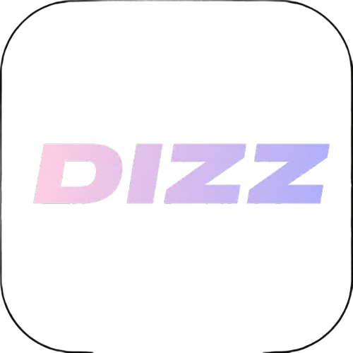

<div align="center">
  
  <h3>DIZZ — Your AI Dating Wingman</h3>
  <p>Upload a chat screenshot. Get sharp, personalized reply suggestions powered by Gemini 2.0 Flash Vision.</p>

  
  
  
  
</div>

---

## What is DIZZ?

There are apps out there charging you **$99/year** to send a screenshot to an LLM and hand you back three lines of text. That's it. That's the "cutting-edge AI" they're selling you.

DIZZ does the same job — and does it well — for free. Open source, self-hosted, no subscription, no upsell screens, no "unlock unlimited rizz" paywall between you and a reply suggestion.

It reads your conversation the way a sharp friend would — sees who said what, picks up on specific details worth referencing, and hands you a few reply options that actually fit the moment. No generic pickup lines, no guessing what to say next, no monthly fee for the privilege.

Screenshot in, smart replies out. That's the whole idea. Take it, fork it, make it better.

---

## ✨ Features

- 📸 **Upload any chat screenshot** — Tinder, Hinge, Instagram DMs, iMessage
- 🤖 **Gemini 2.0 Flash Vision** — reads exactly what she said and generates contextual replies
- 🎯 **3 tailored reply options** — witty, bold, and smooth — all under 15 words
- ⚡ **Keyword focus mode** — steer replies around any topic you want to bring up
- 📊 **Chat Wrapped** — a chemistry breakdown with interest signals, green/red flags, and attachment style
- 🎨 **Polished onboarding** — full-screen video intro, gender selection, and a stats screen

---

## 🚀 Getting Started

### 1. Clone the repo
```bash
git clone https://github.com/daudibrahimhasan/dizz.git
cd dizz
```

### 2. Install dependencies
```bash
npm install
```

### 3. Add your Gemini API key
Create a `.env` file in the project root:
```env
API_KEY=your_api_key_here
```

### 4. Run on your phone
```bash
npx expo start
```
Scan the QR code with **Expo Go** (iOS or Android).

---

## 📦 Build APK
```bash
npx eas build -p android --profile preview
```

---

## 🏗️ Tech Stack

| Layer | Technology |
| :--- | :--- |
| Framework | React Native (Expo) |
| AI Engine | Google Gemini 2.0 Flash (Vision) |
| Navigation | React Native Stack |
| Animations | React Native Animated API |
| Haptics | expo-haptics |
| Video | expo-av |
| Gradients | expo-linear-gradient |
| Build | EAS Build |

---

## 📁 Project Structure
```
dizz/
├── src/
│   ├── screens/
│   │   ├── OnboardingScreen.tsx     # Full-screen video intro
│   │   ├── ChooseGenderScreen.tsx   # Gender selection step
│   │   ├── DIZZStatsScreen.tsx      # Stats screen
│   │   └── DizzMainScreen.tsx       # Core AI reply generator
│   ├── services/
│   │   └── directAiService.ts       # Gemini 2.0 Flash API calls
│   └── store/
│       └── useSettingsStore.ts      # App state management
├── public/
│   ├── Dizz-no-bg.png               # Transparent logo
│   └── Dizz-2.mp4                   # Onboarding video
├── assets/
│   └── icon.png                     # App icon
└── eas.json                         # EAS Build config
```

---

## 🤝 Contributing

Pull requests are welcome. If you're adding a feature, open an issue first so we can discuss direction — especially for anything touching the AI prompt or reply generation logic.

---

## ⚠️ A note on use

DIZZ generates suggestions based on what's in the screenshot, not guarantees. Read the room, personalize before sending, and use good judgment about whose conversations you're uploading — the tool assumes you're using it on your own chats, with real interest in the person you're talking to.

---

<div align="center"> <sub>Built by <a href="https://github.com/daudibrahimhasan">@daudibrahimhasan</a>, founder of <a href="https://github.com/Nexasity">Nexasity AI</a></sub> </div>
